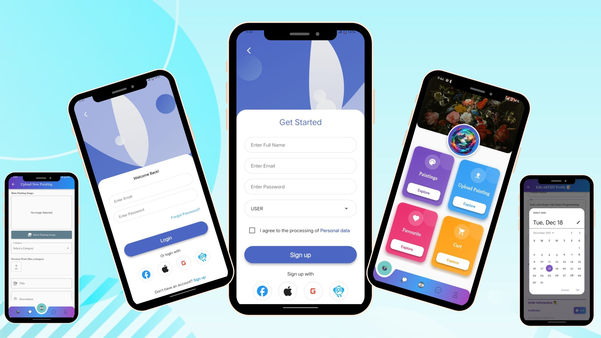
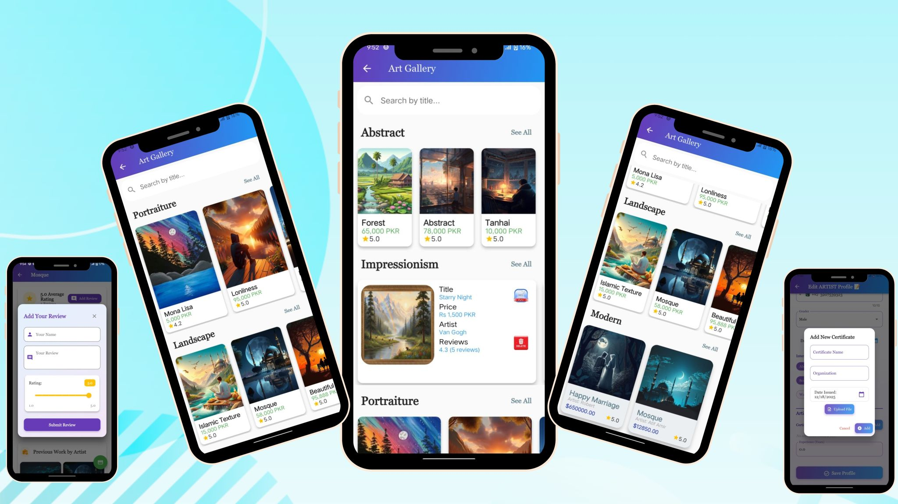
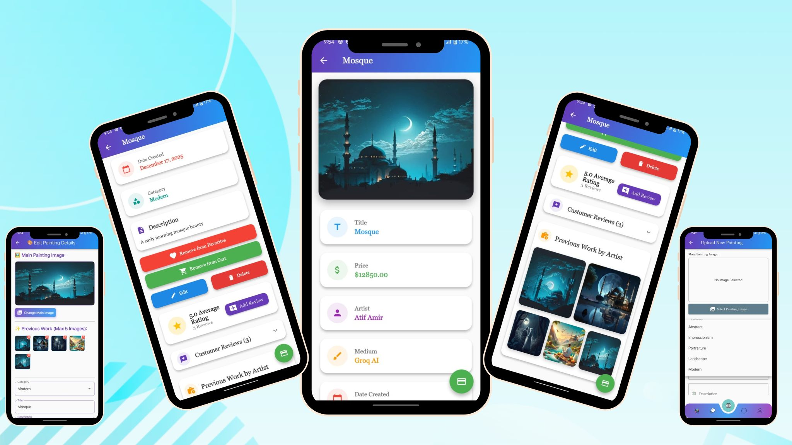
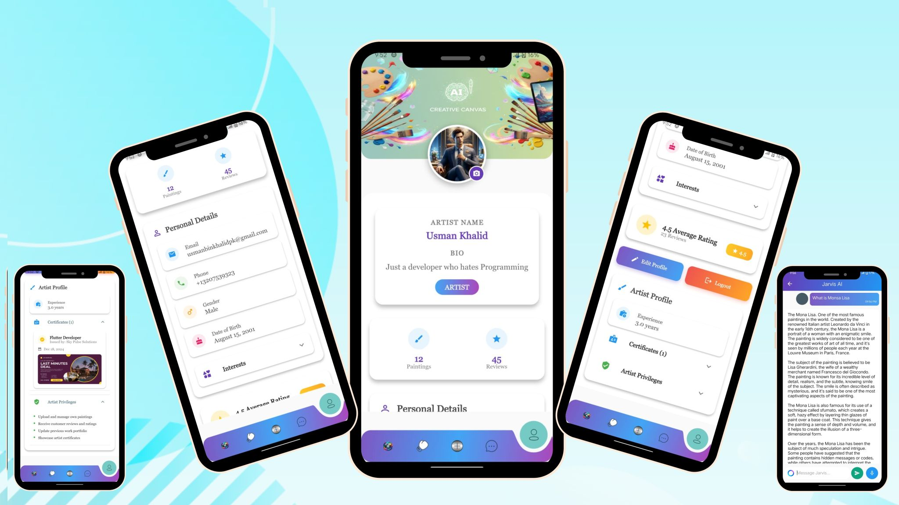
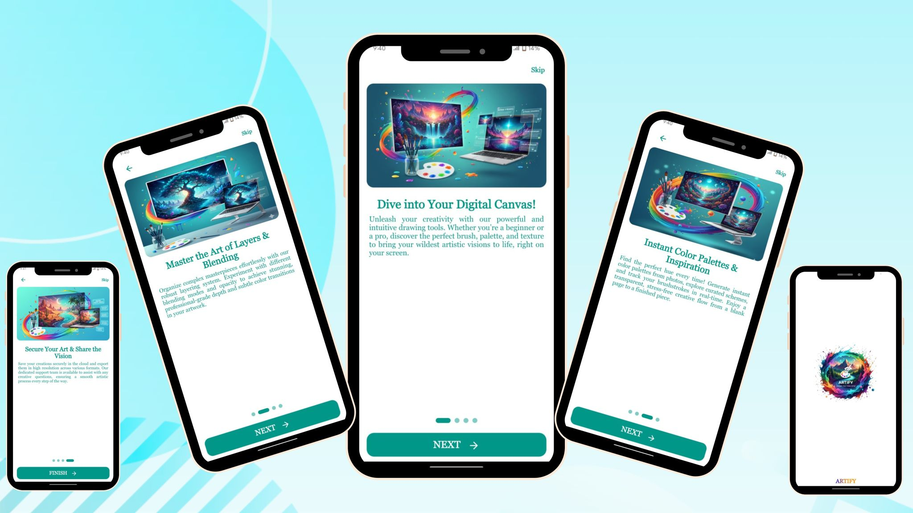
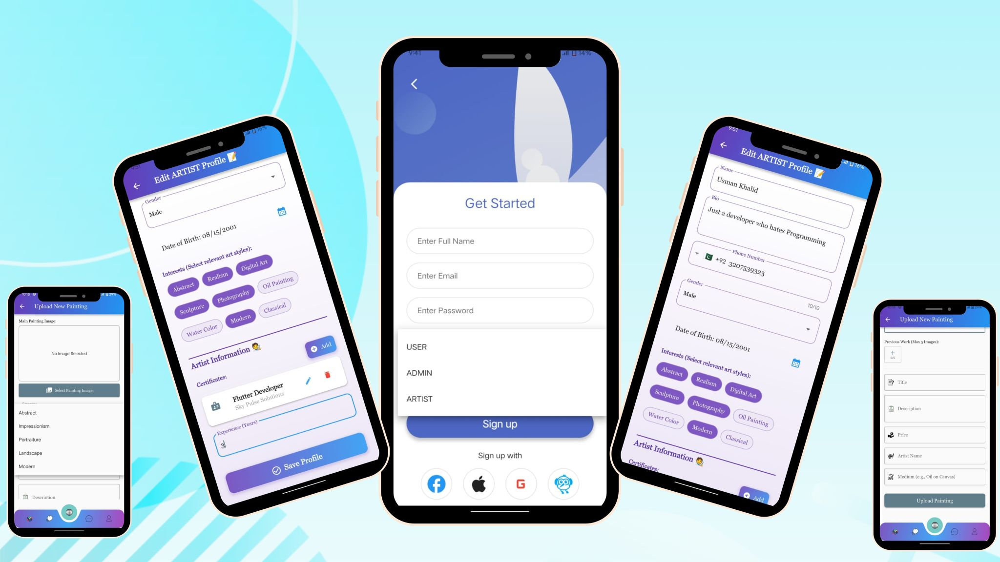

# 🎨 Artify — Complete Art Marketplace App

## 📱 About The Project

Artify is a complete digital art marketplace application developed using Flutter & Dart, designed to provide artists, buyers, and administrators with a smooth, modern, and scalable e-commerce experience for digital and physical artwork.

The application delivers a professional cross-platform experience across Android and iOS with secure architecture, responsive UI, and advanced marketplace functionality.

Built with modern development practices, Artify combines e-commerce features, AI-powered interactions, secure payments, and multi-role management into a single powerful platform.

---

# 🌟 Project Highlights

- 🎨 Complete Art Marketplace
- 💳 Stripe Payment Integration
- 🤖 AI Chatbot Support
- 👥 Multi-Role System
- 🛒 Cart & Favorites
- 🔍 Search & Category Filters
- ⭐ Reviews & Ratings
- 🌙 Dark & Light Theme Support
- 📶 Offline Functionality
- ⚡ Fast & Responsive UI

---

# 🚀 Key Features

## 🎨 Painting Marketplace

Artists can:

- Add, edit, and delete paintings
- Upload artwork images with preview
- Manage artwork categories
- Showcase portfolios professionally
- View customer reviews and ratings

The platform supports categories including:

- Abstract
- Portraiture
- Landscape
- Modern
- Impressionism

Users can browse artwork with detailed previews and zoom functionality.

---

## 💳 Secure Payment System

Artify integrates Stripe Payment Gateway for secure and reliable transactions.

### Features

- Secure checkout process
- Multiple payment methods
- Order tracking
- Transaction history
- Payment confirmation system

---

## 👥 Multi-Role Management System

### 👨‍💼 Admin Panel

- User management
- Content moderation
- Analytics dashboard
- Platform control & monitoring

### 🎨 Artist Panel

- Upload & manage artworks
- Portfolio management
- Artwork performance tracking
- Review management

### 🛍️ User Panel

- Browse and purchase artwork
- Add items to cart
- Save favorites
- Track orders
- Leave reviews & ratings

---

## 🤖 AI Chat Bot

A smart AI-powered chatbot is integrated to enhance user experience.

### AI Features

- Personalized art recommendations
- Customer support assistance
- Smart suggestions
- Interactive user engagement

---

# 🛠️ Technical Highlights

- Clean Architecture (MVVM)
- Repository Pattern
- Offline-first approach using Hive
- Responsive & adaptive UI
- Smooth animations
- Role-based secure authentication
- Cross-platform optimization
- Scalable architecture

---

# 💻 Tech Stack

| Technology | Usage |
|------------|-------|
| Flutter | Frontend Development |
| Dart | Programming Language |
| Hive | Local Database |
| Stripe | Payment Gateway |
| Groq AI | AI Chatbot |
| GitHub | Version Control |
| VS Code | Development Environment |

---

# 🏆 Why Artify Stands Out

- ✅ Complete art ecosystem
- ✅ AI-powered marketplace experience
- ✅ Production-ready architecture
- ✅ Secure payment integration
- ✅ Professional UI/UX
- ✅ Fast & scalable performance
- ✅ Cross-platform support

---

# 🌍 Project Delivery

Successfully delivered to a Pakistani client with a fully functional and scalable implementation.

---

# 💬 Client Feedback

> “The Artify app exceeded expectations with its beautiful design, smooth functionality, and professional implementation.”

---

# 📱 Application Screenshots

  

  

---

# 🤝 Let’s Connect

Looking for a Flutter Developer who can build:

- Custom Flutter Apps
- E-Commerce Solutions
- Scalable Architectures
- Pixel-Perfect UI/UX

📩 Open for freelance & remote projects.

---

# ⭐ Support

If you like this project, don't forget to star the repository ⭐
